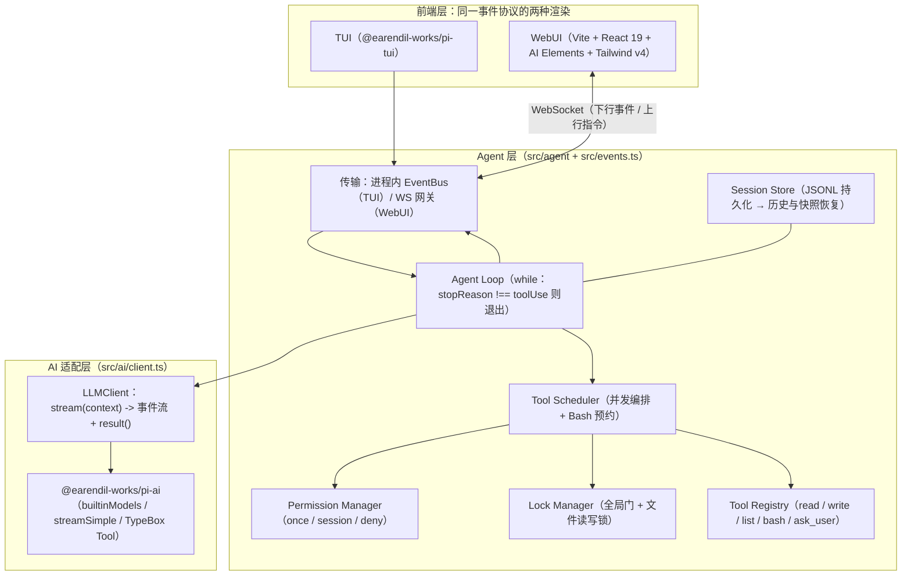
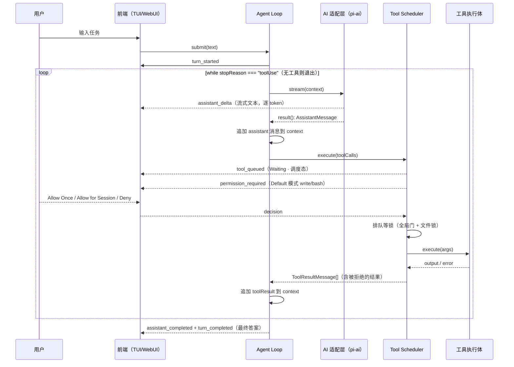
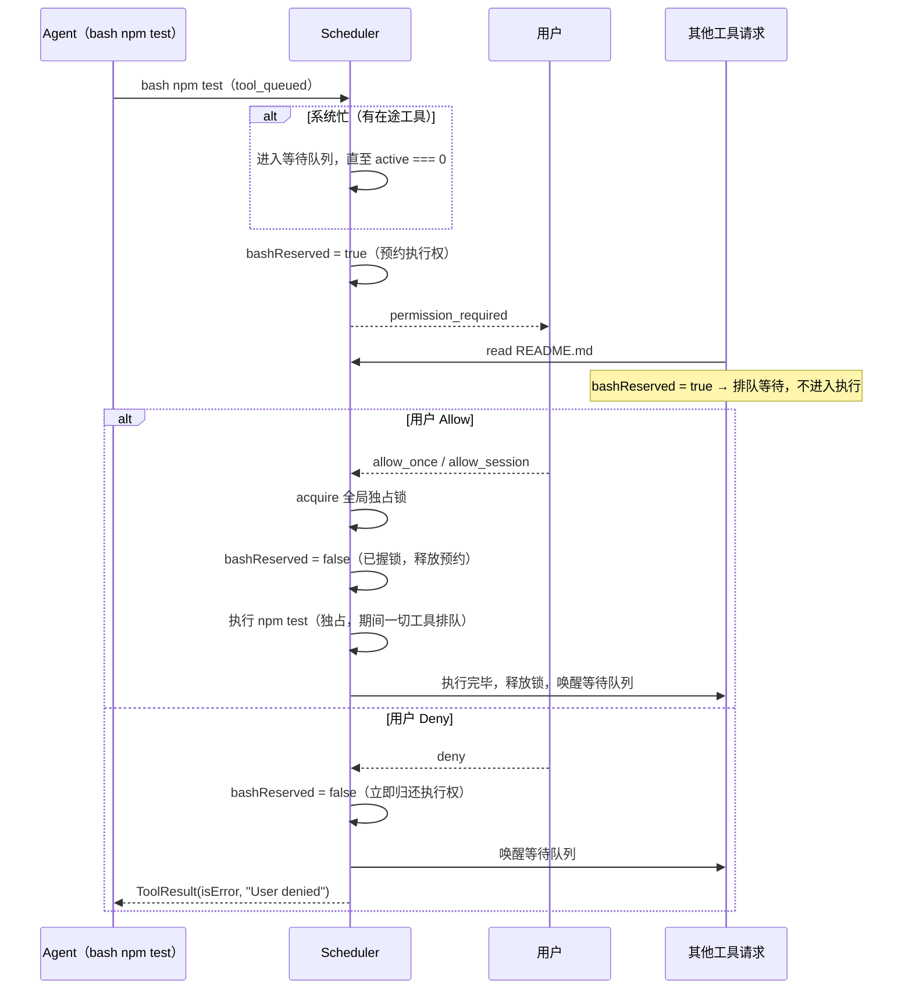

# Minimal Coding Agent 技术方案

> 对应产品方案：`E:\demo\设计方案.md`
> 当前模式：Plan（生成可执行设计）。目标：把产品方案落成「两层架构、三阶段交付」的可编码技术方案。
> 关键约束：AI 层使用 pi 的 AI 包（`@earendil-works/pi-ai`，npm 版本与 `E:\code\pi-mono` 同步，当前 v0.84.4）；Agent 层核心是自写 while 循环（不使用 pi-agent-core）；按 Agent 行为构建统一事件模型，TUI / WebUI 均消费同一事件流；TUI 用 pi-mono 同款库（`@earendil-works/pi-tui`）；WebUI 选新且高 star 的库；总时长约 3 小时；Phase 1 完成后必须先 commit 再进入后续阶段。

---

## 1. 直接结论

- **架构**：两层。AI 适配层（封装 `@earendil-works/pi-ai`，对上只暴露 `stream(context) -> 事件流 + 最终消息`）+ Agent 层（while 循环 + Tool Scheduler + Permission Manager + Lock Manager + Tool Registry + 事件输出）。
- **事件模型**：定义一份 JSON 可序列化的 `AgentEvent` 判别联合（参考 pi-agent-core 的 `AgentEvent` 分类，扩展调度/权限事件）。TUI 进程内直接消费，WebUI 经 WebSocket 消费同一份协议。**前端不持有任何业务状态，一切由事件流推导。**
- **三阶段**：
  - 阶段一 = 面试 Phase 1：TUI + Agent Loop + 4 工具（顺序执行）+ Workspace + 双模式 + 基础权限 → **commit + push**；
  - 阶段二 = 面试 Phase 2 方向 2/3/4：并发调度 + 文件锁 + Bash 全局独占与预约 + 3-option 会话权限 + ask_user（可开关）→ **commit + push**；
  - 阶段三 = 面试 Phase 2 方向 1：WebUI（Vite + React 19 + **AI Elements** + WebSocket）→ **commit + push**。
- **选型结论**：TUI 用 `@earendil-works/pi-tui`；WebUI 用 **AI Elements（vercel/ai-elements，2025-08 发布，约 2.4k star，shadcn/ui 体系）**，备选 assistant-ui（约 11.9k star）；传输层用 WebSocket（`ws`）而非 SSE，因为权限批准 / ask_user 回答需要中途上行，双向通道最简单。
- **模型与厂商**：MiniMax 中国 coding plan——provider `minimax-cn`（Anthropic 兼容端点 `https://api.minimaxi.com/anthropic`），模型 `MiniMax-M2.7`（备选 `MiniMax-M2.7-highspeed`），Key 放 `.env`（`MINIMAX_CN_API_KEY`，pi-ai 自动解析），严禁入库。
- **TypeBox 范围**：仅用于工具参数 schema（`Type.Object` + `Static<>` 编译期类型同源），参数运行时校验复用 pi-ai 导出的 `validateToolArguments`；事件模型与 WS 协议使用纯 TypeScript 类型（锚点 ①），不做运行时校验。
- **工具自述并发语义**：`read / write / bash / list` 的 `description` 直接写明各自并发控制行为与权限要求，让模型能正确地一次并行发起多个调用。
- **read 分页**：按「起始行 offset + 行数 limit」读取，返回带行号；响应上限 ~10k token（CJK 加权估算），超限在行边界截断并提示模型用 `read(offset=…)` 续读。
- **运行指标**：采集**缓存命中率**（`cacheRead / (input+cacheRead+cacheWrite)`，来自 `AssistantMessage.usage`）与**工具执行成功率**（`tool_completed` 事件统计，用户拒绝单独计数），TUI 状态行与 WebUI 顶栏展示。
- **UI 折叠默认**：思考过程与工具执行卡片默认折叠；WebUI 点击展开（AI Elements `Reasoning`/`Tool` 的 `open` 属性），TUI 通过 `/ui` 菜单开关后全量重绘。

---

## 2. 现状理解（已读代码与调研结论）

### 2.1 pi-ai（`@earendil-works/pi-ai` v0.84.4）核心契约

来源：`E:\code\pi-mono\packages\ai`（src/types.ts、README Quick Start），npm 包可直接安装，无需 vendor 源码。

- **模型解析**：`import { builtinModels } from "@earendil-works/pi-ai/providers/all"` → `const models = builtinModels()` → `models.getModel(provider, modelId)`。内置 openai / anthropic / minimax / minimax-cn / zai / google / deepseek / openrouter 等 30+ provider 目录；API Key 经 `options.apiKey` 或 provider 约定环境变量解析（公司 Key 走显式传参最干净）。
- **工具定义**：`Tool { name, description, parameters }`，`parameters` 是 TypeBox schema（包内直接 re-export 了 `Type` 和 `Static`），自带参数校验。
- **上下文**：`Context { systemPrompt?, messages: Message[], tools? }`；`Message = UserMessage | AssistantMessage | ToolResultMessage`。纯数据结构，可序列化，可直接换模型续跑。
- **流式调用**：`models.streamSimple(model, context, { apiKey?, signal?, reasoning? })` 返回 `AssistantMessageEventStream`（AsyncIterable + `.result()`）。事件：`start / text_delta / thinking_delta / toolcall_start / toolcall_delta / toolcall_end / done / error`。
- **终止语义**：`AssistantMessage.stopReason ∈ { stop, length, toolUse, error, aborted, ... }`。**`stopReason === "toolUse"` 即「还有工具要执行」，否则退出 loop**——这正是 Agent 层 while 循环的退出条件。请求级失败不抛异常，而是返回 `stopReason: "error" | "aborted"` 且带 `errorMessage` 的 AssistantMessage，loop 内处理即可。
- **工具结果**：`ToolResultMessage { role: "toolResult", toolCallId, toolName, content, isError, timestamp }`，追加回 `context.messages` 即完成一轮闭环。
- **MiniMax 直连**：`minimax-cn` provider 走 Anthropic 兼容端点（`https://api.minimaxi.com/anthropic`，`anthropic-messages` API），鉴权经 `envApiKeyAuth(["MINIMAX_CN_API_KEY"])` 自动解析；当前目录（v0.84.4）模型为 `MiniMax-M2.7` / `MiniMax-M2.7-highspeed`。`sk-cp-` 前缀的 coding plan Key 即配此端点。
- **测试**：包内导出 Faux provider（`providers/faux.ts`），可脚本化模型行为做离线单测；Agent 层测试则直接注入 fake `streamFn`，完全无网络。另导出 `validateToolArguments(tool, toolCall)`（TypeBox 校验），Scheduler 执行前做防御性参数校验直接复用它。

### 2.2 pi-tui（`@earendil-works/pi-tui` v0.84.4）

差分渲染 TUI 框架（无闪烁、同步输出）。已有组件：`Text / TruncatedText / Markdown / Editor / Input / Loader / SelectList / SettingsList / Box / VStack / HStack / ScrollView / Spacer / Image`，另有 `fuzzyFilter`（模糊过滤）与 autocomplete（文件路径 + slash 命令）。用法：`new TuiMainScreen(new ProcessTerminal())` → `tui.addChild(...)` → `tui.setFocus(editor)` → `tui.start()`。设计方案里的全部 TUI 元素（对话流、◌/✓/× 工具行、三选项权限弹窗、slash 菜单、ask_user 选项卡）都能用现成组件拼出，无需自绘。

### 2.3 WebUI 库调研（build-with-exa 检索结论）

| 库 | star | 创建/发布 | 定位 | 结论 |
| --- | --- | --- | --- | --- |
| **AI Elements**（vercel/ai-elements） | ~2.4k | 2025-08 | shadcn/ui 组件注册表：`Conversation / Message / Response / Tool / Reasoning / PromptInput / Actions` 等 30+ 组件，`Tool` 组件原生支持 `input-streaming / input-available / output-available / output-error` 状态 | **推荐**。最新、Vercel 官方维护、增长快。组件是「复制进项目」的呈现层代码，不绑定传输层——我们用自己的事件流喂数据即可，无侵入 |
| assistant-ui | ~11.9k | 2023-11 | headless 聊天原语 + runtime，`useExternalStoreRuntime` 可接自定义后端 | 备选。原语更全但概念负担重，3 小时内收益不如 AI Elements |
| CopilotKit | ~36.7k | 2023-06 | 全家桶框架 + AG-UI 协议 | 不采用：为「把 copilot 嵌进任意应用」设计，过重；但其 **AG-UI 事件分类法**是本方案事件模型的参考来源之一 |

传输层：SSE 适合单向下行；本任务权限批准、ask_user 回答需要**运行中途上行**，WebSocket 单连接双向最简（`ws` 库，node:http 静态托管前端产物），断线恢复用「连接时下发 snapshot」解决。

### 2.4 事件模型参考

pi-agent-core 的 `AgentEvent`（`packages/agent/src/types.ts`）分类：lifecycle（agent_start/end）、turn（turn_start/end）、message（message_start/update/end）、tool（tool_execution_start/update/end）。本方案沿用该分类骨架，并按设计方案新增**调度态**（tool_queued）与**权限态**（permission_required / permission_resolved）事件——这正是本任务区别于普通 agent 的考察点。

---

## 3. 系统位置与影响边界

- 本项目是**全新独立仓库**（建议名 `mini-coding-agent`），不修改 `E:\code\pi-mono` 任何内容，只以 npm 依赖形式消费 `pi-ai` / `pi-tui`（版本锁定 `^0.84.4`，与已 pull 的仓库一致）。
- 影响边界：仅本仓库。pi-ai 的类型（`Context / Message / Tool`）允许被 Agent 层 import 复用（它们是纯类型 + TypeBox），但 **Agent 层不 import pi-ai 的执行函数**——所有 LLM 调用收敛到 AI 适配层，保证换 provider、换模型、离线测试都只动一层。
- 不改动项：`设计方案.md` 的产品语义（双模式、并发规则总表、权限顺序、Bash 独占原则）是本方案的**规格**，实现不得偏离；冲突时以规格为准。

---

## 4. 总体架构



两层职责边界：

- **AI 适配层**（`src/ai/client.ts`，约 40 行）：构建 `Models`、解析 provider/model、注入 API Key、暴露 `stream(context, { signal })`。对上只暴露一个最小接口，pi-ai 的事件类型在转发处就地翻译成 `AgentEvent`，不外溢。
- **Agent 层**（`src/agent/`）：`loop.ts`（while 循环，只关心「推理 → 工具 → 回填 → 再推理」）、`scheduler.ts`（权限 + 调度 + 锁的唯一入口，Loop 对并发完全无感知）、`tools/`（每个工具一个文件：schema、kind、执行体）、`session.ts`（历史持久化）。事件模型 `src/events.ts` 是本层对前端的**唯一输出契约**。

---

## 5. 核心流程

### 5.1 Agent Loop（while 循环）



要点：

1. **退出条件只有两个**：`stopReason !== "toolUse"`（正常出答案），或 `stopReason ∈ { error, aborted }`（发 `agent_error` 后终止本轮）。没有隐式 break。
2. Loop 对「并行、锁、权限、排队」零感知：`scheduler.execute(toolCalls)` 返回时，所有工具调用（含被 Deny 的）都已变成合法的 `ToolResultMessage`。并发冲突属于 Scheduler 职责（设计方案 §14），Loop 永远不会给模型返回「File Locked」错误。
3. 中断：`AbortSignal` 贯穿——LLM 流被 abort 后返回 `stopReason: "aborted"`，工具执行体检查 signal（bash 杀子进程树），Loop 捕获后优雅收尾。

### 5.2 Bash 调度与 Approval Reservation（竞态核心）

对应设计方案 §9–§11。关键不变量：**先拿到执行资格，再打扰用户；批准后必须立刻能执行；拒绝则立即归还执行资格。**



write 的顺序则相反（设计方案 §13）：**先权限、后锁**——用户迟迟不点弹窗时不能无意义占住文件锁。两类顺序差异在 6.3 的状态机中显式体现。

---

## 6. 契约级细节

### 6.1 统一事件模型（`src/events.ts`，落地锚点 ①）

判别联合，全部字段 JSON 可序列化（WebUI 直接走 WebSocket）。状态映射：前端时间线里 `tool_queued` → 「Waiting 行」；`tool_started` → ◌ Running；`tool_completed(ok)` → ✓；`tool_completed(!ok)` → ×（可展开 error）。Waiting 不进入执行状态机（设计方案 §17/§18）。

### 6.2 WebSocket 协议（WebUI 专用）

下行（server → client）：全部 `AgentEvent`，外加两条控制消息：

| 消息 | 字段 | 说明 |
| --- | --- | --- |
| `snapshot` | `sessionId, mode, askUserEnabled, events: AgentEvent[]` | 连接/切会话时下发，前端用它重建整个界面（解决刷新恢复） |
| `session_list` | `sessions: { id, title, updatedAt }[]` | 左侧历史栏 |

上行（client → server）：

| type | payload | 说明 |
| --- | --- | --- |
| `user_message` | `text` | 新任务；服务端生成 messageId |
| `permission_response` | `requestId, decision` | 对应 UI 三选项 |
| `ask_user_response` | `callId, answer` | ask_user 回答（含 Custom Input） |
| `mode_change` | `mode` | default / full_access |
| `ask_user_toggle` | `enabled` | 动态增删工具 schema（不是返回 denied，设计方案 §22） |
| `interrupt` | — | abort 当前运行 |
| `session_new` / `session_load` | `sessionId?` | 侧栏操作 |

### 6.3 Tool Scheduler 状态机与顺序规则

每个工具调用的生命周期（调度态 → 执行态）：

```text
queued ──(需权限且 Default 模式)──> awaiting_permission ──allow──> running ──> completed(ok)
   │                                        └──deny───> completed(isError: "User denied")
   └────────(无需权限)──────────────────────────────────────> running
```

执行前的**顺序规则**（严格对应设计方案 §10/§11/§13/§16）：

| 工具 | 步骤 |
| --- | --- |
| `read` | 等 bashReserved 清除 → acquireGate(shared) → acquireFile(key, read) → 执行 → 逆序释放 |
| `write` | 权限确认 → 等 bashReserved 清除 → acquireGate(shared) → acquireFile(key, write) → 执行 → 逆序释放 |
| `list` / `ask_user` | 等 bashReserved 清除 → acquireGate(shared) → 执行 → 释放 |
| `bash` | 等 active===0 且无预约 → **预约** → 权限确认 →（Deny：释放预约；Allow：）acquireGate(exclusive) → 释放预约 → 执行 → 释放 |

并发规则总表（设计方案 §16，单测逐行覆盖）：

| 正在执行 | 新 read | 新 write | 新 list | 新 bash |
| --- | --- | --- | --- | --- |
| read A | ✅ | 同文件等待 | ✅ | 等待 |
| write A | 同文件等待 | 同文件等待 | ✅ | 等待 |
| list | ✅ | ✅ | ✅ | 等待 |
| bash | 等待 | 等待 | 等待 | 等待 |

锁键：`path.resolve(workspace, args.path)` 归一化为绝对路径，防止 `./a.py` 与 `a.py` 视为两把锁。

### 6.4 权限管理

- `PermissionManager` 接口：`request(call, summary) -> Promise<"allow_once" | "allow_session" | "deny">`。TUI 实现 = SelectList 三选项；WebUI 实现 = 发 `permission_required` 事件、挂起 Promise、等 `permission_response`。**Agent 层只有接口，不知道 UI 形态。**
- `allow_session` 缓存在 Scheduler 内存 `Set<toolName>`，Session 结束即失效（设计方案 §6）。
- Full Access 模式：跳过权限层 + 取消 Workspace 路径检查。`/mode` 切换即时生效，且只在两轮工具之间切换（不中断在途调用）。
- ask_user 开关：ON/OFF 直接增删传给模型的 `Context.tools`（`ToolRegistry.list(enabled)`），模型看不到就永远不会调（设计方案 §22）。

### 6.5 工具规格：TypeBox、并发语义 description 与 read 分页

**原则：TypeBox 是工具层的单一事实来源**——`Type.Object` 定义 schema，`Static<typeof schema>` 推导执行体的编译期参数类型，pi-ai 直接消费同一 schema 发给模型，Scheduler 执行前用 pi-ai 导出的 `validateToolArguments` 做防御性校验（模型幻觉出的非法参数会变成干净的 isError 结果而非异常）。每个参数都写 `description`，每个工具的 `description` 都写明**并发控制行为**——这是模型能否正确并行发起调用的关键（MiniMax-M2 走 anthropic-messages API，单轮天然支持多 toolCall 并行返回）。

四个基础工具的 description 全文（面向模型，英文；UI 文案才要求中文）：

| 工具 | kind | description（写入 Tool.description 的全文） |
| --- | --- | --- |
| `read` | read | "Read a text file and return numbered lines. Pagination: pass `offset` (1-based start line) and `limit` (max lines). The response is capped at ~10k tokens; when truncated you get a notice with the next offset — call read again with that offset to continue. Concurrency: reads never require user approval; multiple reads, even of the same file, run in parallel; reads queue while a bash command is running." |
| `write` | write | "Create or overwrite a file (parent directories are created automatically). Concurrency: exclusive per file — a write waits until all in-flight reads/writes of the same file finish; writes to different files run in parallel. Never runs while a bash command executes (bash is globally exclusive). In Default mode every write needs user approval (Allow Once / Allow for Session / Deny); approval is requested before any lock is taken, so an unanswered dialog never blocks other files." |
| `bash` | bash | "Execute a shell command in the workspace via bash. Concurrency: globally exclusive — while a command runs, no other tool (read/write/list/bash) executes; everything queues. A queued bash first reserves the execution slot, then asks for approval, so once you are approved the command starts immediately; a Deny releases the slot instantly. In Default mode every command needs user approval." |
| `list` | list | "List a directory's entries with name/type/size. Read-only. Concurrency: runs in parallel with other reads/writes/lists and never needs approval; only queues while bash is executing." |
| `ask_user` | ask | "Ask the human a question and block until they answer; the answer is returned to you as the tool result. Provide 2-4 short options when possible; the user can always reply with custom input. Use it only for genuine ambiguity (requirements, trade-offs), never for facts you can look up yourself. While waiting, other in-flight tools keep running." |

read 工具锚点规格（TypeBox + 分页 + token 上限）：

```typescript
import { Type, type Static } from "@earendil-works/pi-ai";

export const ReadArgs = Type.Object({
	path: Type.String({ description: "File path, relative to workspace (absolute allowed only in Full Access mode)" }),
	offset: Type.Optional(Type.Integer({ minimum: 1, default: 1, description: "1-based start line" })),
	limit: Type.Optional(Type.Integer({ minimum: 1, maximum: 2000, default: 500, description: "Max lines to return" })),
});
export type ReadArgs = Static<typeof ReadArgs>;

const TOKEN_CAP = 10_000;
// CJK 加权估算：汉字/假名/谚文 ≈ 1.5 token/字，其余 ≈ 4 字符/token
export function estimateTokens(s: string): number {
	let cjk = 0;
	for (const ch of s) if (/\p{Script=Han}|\p{Script=Hiragana}|\p{Script=Katakana}|\p{Script=Hangul}/u.test(ch)) cjk++;
	return Math.ceil(cjk * 1.5) + Math.ceil((s.length - cjk) / 4);
}

// 执行体要点：
// 1. Default 模式先做 Workspace 边界校验（resolve + 前缀检查），越界 → isError
// 2. 取 lines = content.split("\n")，从 offset-1 行起，逐行累加到预算用尽（行边界截断）
// 3. 输出行格式 `${lineNo}: ${text}`；若截断则尾部追加：
//    `[Truncated] Showing lines {offset}-{last} of {total} (~{tokens} tokens, cap {TOKEN_CAP}). Call read(path, offset={last + 1}) to continue.`
// 4. limit 与 token cap 双重生效，取更小者
```

### 6.6 Context 三段式组装

每轮 LLM 调用的 `Context` 由三个独立来源组装，一一对应 pi-ai 的 `Context { systemPrompt, messages, tools }`：

| 部分 | 来源 | 稳定性要求（缓存敏感） |
| --- | --- | --- |
| `systemPrompt` | `SystemPromptBuilder(workspace, mode, date)`：角色、Workspace 路径、当前模式语义、并发/权限行为说明、回复语言跟随用户 | 同一模式下字节级稳定；`/mode` 切换会改变前缀 → 缓存失效一次，属预期 |
| `messages` | 会话历史（append-only：user / assistant / toolResult 依次追加，永不改写旧消息） | 追加式保证前缀缓存逐轮命中 |
| `tools` | `ToolRegistry.list(askUserEnabled)`：固定顺序（read, write, list, bash[, ask_user]） | ask_user 开关变化会改变 tools 前缀 → 一次缓存失效，属预期；数组顺序必须稳定 |

组装器 `buildContext(parts)` 是纯函数；`ask_user` 开关只影响 `tools` 三段之一，不触碰其余两段。

### 6.7 指标采集：缓存命中率与工具执行成功率

`MetricsCollector`（订阅事件总线，纯累加器，无 IO）：

```typescript
export class MetricsCollector {
	tools = { ok: 0, failed: 0, denied: 0 }; // denied 单独计数，不计入失败率
	usage: TokenUsage = { input: 0, output: 0, cacheRead: 0, cacheWrite: 0 };
	turns = 0;

	onEvent(ev: AgentEvent): void {
		if (ev.type === "assistant_completed" && ev.usage) {
			this.turns++;
			for (const k of ["input", "output", "cacheRead", "cacheWrite"] as const) this.usage[k] += ev.usage[k];
		}
		if (ev.type === "tool_completed") ev.ok ? this.tools.ok++ : this.tools.failed++;
		if (ev.type === "permission_resolved" && ev.decision === "deny") this.tools.denied++;
	}
	// 命中率分母 = 三类输入 token 之和（pi-ai 的 Usage 中 input 与 cache 字段分立，Anthropic 语义）
	get cacheHitRate(): number {
		const denom = this.usage.input + this.usage.cacheRead + this.usage.cacheWrite;
		return denom === 0 ? 0 : this.usage.cacheRead / denom;
	}
	get toolSuccessRate(): number {
		const n = this.tools.ok + this.tools.failed;
		return n === 0 ? 1 : this.tools.ok / n;
	}
}
```

- **缓存命中率**：逐轮从 `assistant_completed.usage` 累加；首轮通常为 0（cacheWrite），第二轮起显著上升——演示时正好展示 MiniMax 上下文缓存生效。落地后需跑一次真实请求核对 MiniMax 返回的 usage 字段语义（若 input 已含缓存 token，则调整分母，公式集中在这一个 getter 里，改动点唯一）。
- **工具执行成功率**：`tool_completed` 事件统计；**用户 Deny 不算失败**（那是权限系统按设计工作），单独以 `denied` 计数展示。
- **展示**：TUI 每轮 `turn_completed` 后打一行摘要 `cache 62% · tools 5/6 · deny 1 · $0.0042`；WebUI 顶栏常驻两个 chip。成本可顺带从 pi-ai `usage.cost.total` 累加。
- **实现位置**：`MetricsCollector` 是纯事件消费者——TUI 进程内、WebUI 前端各自实例化一份喂同一事件流即可，无需服务端 RPC；这也顺势验证了「一切状态由事件推导」的架构承诺。

### 6.8 Workspace 边界与 Bash 的诚实说明

- `read / write / list`：Default 模式下 `resolve + 前缀校验`，越界直接返回 isError 结果给模型（不抛异常）。
- `bash`：无法在不引入容器/Job Object 的前提下可靠沙箱（Windows 上尤甚）。设计方案 §3.1 与此对齐：read / write / list 为硬边界，bash 为 best-effort。实现上 `cwd = workspace` + 通过 `bash -lc` 执行（本机 Git Bash），并在系统提示词中声明边界；**这是有意识的取舍而非遗漏**，方案文档与 README 明确写出让面试官看到权衡。Full Access 模式下此项无意义，自然消解。

### 6.9 模型与鉴权配置（MiniMax 中国 Coding Plan）

```text
mini-agent [--interface tui|web]     # provider/model 默认取 .env
.env（gitignore，严禁入库）:
  MINI_AGENT_PROVIDER=minimax-cn
  MINI_AGENT_MODEL=MiniMax-M2.7        # 备选 MiniMax-M2.7-highspeed（低延迟）
  MINIMAX_CN_API_KEY=sk-cp-****        # coding plan Key，pi-ai envApiKeyAuth 自动解析
```

- `minimax-cn` 在 pi-ai v0.84.4 中走 **Anthropic 兼容端点** `https://api.minimaxi.com/anthropic`（`anthropic-messages` API），天然支持流式、多 toolCall 并行与 prompt cache 字段；`sk-cp-` 前缀的 coding plan Key 直接可用。
- Key 加载：启动时读取 `.env`（`node --env-file=.env` 或手动读取），经 `createLLMClient({ provider, modelId, apiKey })` 显式传入 `streamSimple({ apiKey })`；同时保留环境变量名 `MINIMAX_CN_API_KEY`，pi-ai 的 provider auth 也能自动解析，双通道兜底。
- **Key 卫生**：`.env` 进 `.gitignore` 首行；README/文档/录屏中出现 Key 的地方一律打码；仓库推送前 `rg "sk-cp-"` 自查一遍。
- 若公司 Key 只适配 coding plan 网关且默认 baseUrl 不通：pi-ai 支持 `createProvider` 覆盖 baseUrl（README「Custom Providers」节），AI 适配层加 ~15 行即可，联系负责人确认端点。

### 6.10 UI 折叠行为（TUI 与 WebUI 一致）

| 内容 | 默认 | 折叠态渲染 | 展开方式 |
| --- | --- | --- | --- |
| 思考过程（thinking） | **折叠** | 一行 `💭 thinking (3.2s)` | WebUI：点击行 toggle；TUI：`/ui` 菜单开「展开思考过程」 |
| 工具执行 | **折叠** | 单行 `✓ read src/main.py (12ms)` / `× bash npm test`（× 可展开错误） | WebUI：点击卡片 toggle；TUI：`/ui` 菜单开「展开工具详情」 |
| ask_user / 权限卡 | 展开 | — | 阻塞性交互卡片，永不折叠 |

- 折叠是**纯渲染层行为**：事件流不变，前端 display state（React state / TUI 布尔位）决定渲染深度；TUI 切换开关后对 transcript 全量重绘（pi-tui 差分渲染，成本低）。
- WebUI 用 AI Elements 现成属性：`Reasoning` 默认 `open={false}`；`Tool` 组件收起时只显示标题行，展开显示 args/output/error/duration。
- TUI 的 `/ui` 是第五个 slash command（`/mode /ask-user /ui /clear /help`），菜单用 `SettingsList` 两项布尔开关。

---

## 7. 落地锚点（三份核心代码，Code 模式直接采用，不得重写）

### 7.1 锚点 ①：`src/events.ts` —— 统一事件模型

```typescript
// 统一事件模型：Agent 运行时的唯一事实来源。
// TUI（进程内）与 WebUI（WebSocket）消费同一份协议；前端不持有业务状态，一切由事件推导。

export type RunMode = "default" | "full_access";
export type PermissionDecision = "allow_once" | "allow_session" | "deny";

export interface ToolCallInfo {
	callId: string;
	toolName: string;
	args: Record<string, unknown>;
}

/** 来自 AssistantMessage.usage 的子集，供指标采集（缓存命中率等） */
export interface TokenUsage {
	input: number;
	output: number;
	cacheRead: number;
	cacheWrite: number;
}

export type AgentEvent =
	// ── 会话与开关 ──
	| { type: "session_started"; sessionId: string; workspace: string; mode: RunMode }
	| { type: "mode_changed"; mode: RunMode }
	| { type: "ask_user_toggled"; enabled: boolean }
	// ── 一轮任务（turn = 一次用户输入到最终答案）──
	| { type: "user_message_added"; messageId: string; content: string; timestamp: number }
	| { type: "turn_started"; turnId: string }
	| { type: "assistant_started"; messageId: string }
	| { type: "assistant_delta"; messageId: string; delta: string }
	| { type: "assistant_completed"; messageId: string; text: string; stopReason: string; usage?: TokenUsage }
	| { type: "turn_completed"; turnId: string; stopReason: string }
	// ── 工具：调度态（queued）与执行态（started/completed）严格分离 ──
	| { type: "tool_queued"; call: ToolCallInfo }
	| { type: "permission_required"; requestId: string; call: ToolCallInfo; summary: string }
	| { type: "permission_resolved"; requestId: string; decision: PermissionDecision }
	| { type: "tool_started"; callId: string }
	| { type: "tool_completed"; callId: string; toolName: string; ok: boolean; durationMs: number; output?: string; error?: string }
	// ── ask_user ──
	| { type: "user_input_requested"; callId: string; question: string; options: string[] }
	| { type: "user_input_received"; callId: string; answer: string }
	// ── 异常 ──
	| { type: "agent_error"; message: string };
```

### 7.2 锚点 ②：`src/ai/client.ts` + `src/agent/loop.ts` —— AI 适配层与 while 循环

```typescript
// src/ai/client.ts —— AI 适配层：pi-ai 只在此文件出现执行调用
import { builtinModels, type Context, type Model } from "@earendil-works/pi-ai";

export interface LLMStream {
	// 与 pi-ai 的 AssistantMessageEventStream 同构；收窄成最小接口便于测试替换
	subscribe(onEvent: (ev: { type: string; delta?: string }) => void): void;
	result(): Promise<import("@earendil-works/pi-ai").AssistantMessage>;
}

export interface LLMClient {
	model: Model<string>;
	stream(context: Context, opts?: { signal?: AbortSignal }): LLMStream;
}

export function createLLMClient(config: { provider: string; modelId: string; apiKey?: string }): LLMClient {
	const models = builtinModels();
	const model = models.getModel(config.provider, config.modelId);
	if (!model) throw new Error(`Unknown model: ${config.provider}/${config.modelId}`);
	return {
		model,
		stream: (context, opts) =>
			models.streamSimple(model, context, { apiKey: config.apiKey, signal: opts?.signal }) as LLMStream,
	};
}
```

```typescript
// src/agent/loop.ts —— Agent 层核心：一个 while 循环
// 退出条件：stopReason !== "toolUse"（含 error/aborted 分支）。对权限/并发/锁零感知。
import type { AssistantMessage, Context, ToolCall } from "@earendil-works/pi-ai";
import type { AgentEvent, TokenUsage } from "../events.ts";
import type { LLMClient } from "../ai/client.ts";
import type { ToolScheduler } from "./scheduler.ts";

export interface AgentLoopOptions {
	client: LLMClient;
	scheduler: ToolScheduler;
	emit: (event: AgentEvent) => void;
	signal?: AbortSignal;
}

const isToolCall = (c: AssistantMessage["content"][number]): c is ToolCall => c.type === "toolCall";
const textOf = (m: AssistantMessage) =>
	m.content.filter((c) => c.type === "text").map((c) => c.text).join("");
const usageOf = (u: AssistantMessage["usage"]): TokenUsage =>
	({ input: u.input, output: u.output, cacheRead: u.cacheRead, cacheWrite: u.cacheWrite });

export async function runAgentLoop(context: Context, opts: AgentLoopOptions): Promise<void> {
	const { client, scheduler, emit, signal } = opts;
	const turnId = `turn-${Date.now().toString(36)}`;
	emit({ type: "turn_started", turnId });

	try {
		while (!signal?.aborted) {
			// 1) LLM 推理：流式 delta 一对一转发为 UI 事件
			const assistantId = `assistant-${Date.now().toString(36)}`;
			emit({ type: "assistant_started", messageId: assistantId });
			const stream = client.stream(context, { signal });
			void stream.subscribe((ev) => {
				if (ev.type === "text_delta" && ev.delta) emit({ type: "assistant_delta", messageId: assistantId, delta: ev.delta });
			});
			const message = await stream.result();
			context.messages.push(message);

			// 2) 失败/中止：终止本轮
			if (message.stopReason === "error" || message.stopReason === "aborted") {
				emit({ type: "agent_error", message: message.errorMessage ?? "LLM request failed" });
				emit({ type: "turn_completed", turnId, stopReason: message.stopReason });
				return;
			}
			emit({ type: "assistant_completed", messageId: assistantId, text: textOf(message), stopReason: message.stopReason, usage: usageOf(message.usage) });

			// 3) 退出条件：没有工具需要执行 → 最终答案，退出 loop
			const toolCalls = message.content.filter(isToolCall);
			if (message.stopReason !== "toolUse" || toolCalls.length === 0) {
				emit({ type: "turn_completed", turnId, stopReason: message.stopReason });
				return;
			}

			// 4) 工具执行：权限/排队/锁/并发全部由 Scheduler 负责，Loop 只等最终结果
			const results = await scheduler.execute(toolCalls);
			context.messages.push(...results);
			// 继续 while：带着工具结果进入下一轮推理
		}
		emit({ type: "turn_completed", turnId, stopReason: "aborted" });
	} catch (err) {
		emit({ type: "agent_error", message: err instanceof Error ? err.message : String(err) });
		emit({ type: "turn_completed", turnId, stopReason: "error" });
	}
}
```

> 注：`subscribe` 是 pi-ai `AssistantMessageEventStream`（AsyncIterable）的薄封装（3 行 `for await` 即可实现），写代码时若直接 `for await` 更顺，可保持 `subscribe` 语义不变替换实现。

### 7.3 锚点 ③：`src/agent/scheduler.ts` —— 权限 + 调度 + 锁（面试考察核心）

```typescript
// Tool Scheduler：并发冲突的唯一裁决点。
// 两级锁：全局门（bash 独占 / 其余共享）+ 文件读写锁（read 共享 / write 独占）。
// bash 预约（bashReserved）：先拿执行资格再打扰用户；Deny 立即归还。
import path from "node:path";
import type { ToolCall, ToolResultMessage } from "@earendil-works/pi-ai";
import type { AgentEvent, PermissionDecision, RunMode, ToolCallInfo } from "../events.ts";
import type { AgentTool } from "./tools/index.ts";

export interface PermissionRequester {
	request(call: ToolCallInfo, summary: string): Promise<PermissionDecision>;
}

/** 文件锁等待者：write=true 表示独占写请求；bash 位仅全局门使用 */
type FileWaiter = { write: boolean; resolve: () => void };
/** 全局门等待者：bash=true 表示独占执行请求 */
type GateWaiter = { bash: boolean; resolve: () => void };

class LockManager {
	private shared = 0; // 全局门共享持有数（read/write/list/ask_user）
	private exclusive = false; // bash 持有全局独占
	private gateWaiters: GateWaiter[] = [];
	private files = new Map<string, { readers: number; writer: boolean; waiters: FileWaiter[] }>();

	async acquireGate(bash: boolean): Promise<void> {
		if (bash) {
			if (!this.exclusive && this.shared === 0 && this.gateWaiters.length === 0) { this.exclusive = true; return; }
			await new Promise<void>((r) => this.gateWaiters.push({ bash: true, resolve: r }));
			return;
		}
		if (!this.exclusive && this.gateWaiters.length === 0) { this.shared++; return; }
		await new Promise<void>((r) => this.gateWaiters.push({ bash: false, resolve: r }));
	}

	releaseGate(bash: boolean): void {
		if (bash) this.exclusive = false; else this.shared--;
		this.pumpGate();
	}

	private pumpGate(): void {
		while (this.gateWaiters.length > 0) {
			const w = this.gateWaiters[0];
			if (w.bash) {
				if (this.exclusive || this.shared > 0) return;
				this.gateWaiters.shift(); this.exclusive = true; w.resolve();
				return; // bash 独占后停止放行
			}
			if (this.exclusive) return;
			this.gateWaiters.shift(); this.shared++; w.resolve(); // 共享请求可连续批量放行
		}
	}

	async acquireFile(key: string, mode: "read" | "write"): Promise<void> {
		let f = this.files.get(key);
		if (!f) { f = { readers: 0, writer: false, waiters: [] }; this.files.set(key, f); }
		if (mode === "read" && !f.writer && f.waiters.length === 0) { f.readers++; return; }
		if (mode === "write" && !f.writer && f.readers === 0 && f.waiters.length === 0) { f.writer = true; return; }
		await new Promise<void>((r) => f!.waiters.push({ write: mode === "write", resolve: r }));
	}

	releaseFile(key: string, mode: "read" | "write"): void {
		const f = this.files.get(key); if (!f) return;
		if (mode === "read") f.readers--; else f.writer = false;
		while (f.waiters.length > 0) {
			const w = f.waiters[0];
			if (w.write) {
				if (f.readers === 0 && !f.writer) { f.waiters.shift(); f.writer = true; w.resolve(); }
				return; // 队首是写请求但不满足条件 → 停止放行（FIFO 防写饥饿）
			}
			if (f.writer) return;
			f.waiters.shift(); f.readers++; w.resolve(); // 队首读请求 → 连续批量放行
		}
	}
}

export class ToolScheduler {
	private active = 0; // 在途工具数（含排队/等权限/执行中）
	private bashReserved = false;
	private bashReservedWaiters: Array<() => void> = [];
	private activeWaiters: Array<() => void> = [];
	private sessionGrants = new Set<string>();
	private locks = new LockManager();

	constructor(
		private readonly registry: { get(name: string): AgentTool | undefined },
		private readonly permissions: PermissionRequester,
		private readonly emit: (e: AgentEvent) => void,
		private readonly ctx: { workspace: string; getMode(): RunMode; signal?: AbortSignal },
	) {}

	private get idle(): boolean { return this.active === 0 && !this.bashReserved; }

	private notifyBashCleared(): void { for (const w of this.bashReservedWaiters.splice(0)) w(); }

	private async waitUntilBashCleared(): Promise<void> {
		while (this.bashReserved) await new Promise<void>((r) => this.bashReservedWaiters.push(r));
	}

	private async waitUntilIdle(): Promise<void> {
		while (!this.idle) await new Promise<void>((r) => this.activeWaiters.push(r));
	}

	async execute(calls: ToolCall[]): Promise<ToolResultMessage[]> {
		this.active += calls.length;
		const tasks = calls.map(async (c) => {
			try { return await this.runOne(c); }
			finally { this.active--; if (this.idle) for (const w of this.activeWaiters.splice(0)) w(); }
		});
		return Promise.all(tasks);
	}

	private async runOne(call: ToolCall): Promise<ToolResultMessage> {
		const info: ToolCallInfo = { callId: call.id, toolName: call.name, args: (call.arguments ?? {}) as Record<string, unknown> };
		this.emit({ type: "tool_queued", call: info });
		const startedAt = Date.now();
		const finish = (ok: boolean, text: string, extra?: Partial<Parameters<ToolScheduler["emit"]>[0]>) => {
			const durationMs = Date.now() - startedAt;
			this.emit({ type: "tool_completed", callId: call.id, toolName: call.name, ok, durationMs, output: ok ? text : undefined, error: ok ? undefined : text });
			const result: ToolResultMessage = {
				role: "toolResult", toolCallId: call.id, toolName: call.name,
				content: [{ type: "text", text }], isError: !ok, timestamp: Date.now(),
			};
			return result;
		};

		const tool = this.registry.get(call.name);
		if (!tool) return finish(false, `Unknown tool: ${call.name}`);
		const mode = this.ctx.getMode();

		// ── 阶段 1：权限（先要批准，后占资源）──
		if (mode === "default" && (tool.kind === "write" || tool.kind === "bash") && !this.sessionGrants.has(tool.name)) {
			let reservedHere = false;
			if (tool.kind === "bash") {
				await this.waitUntilIdle();       // bash：先等全部在途工具结束
				this.bashReserved = true;         // 预约执行权，挡住新工具
				reservedHere = true;
			}
			const decision = await this.permissions.request(info, tool.describe(info.args));
			this.emit({ type: "permission_resolved", requestId: call.id, decision });
			if (decision === "deny") {
				if (reservedHere) { this.bashReserved = false; this.notifyBashCleared(); } // Deny 立即归还资格
				return finish(false, "User denied permission for this tool call.");
			}
			if (decision === "allow_session") this.sessionGrants.add(tool.name);
			// Allow：bash 保持预约，直到下方拿到独占锁后再释放
			if (tool.kind !== "bash") { /* write：不持任何锁，直接进入阶段 2 */ }
		}

		// ── 阶段 2：加锁执行 ──
		try {
			if (tool.kind === "bash") {
				await this.locks.acquireGate(true);          // 全局独占
				this.bashReserved = false; this.notifyBashCleared(); // 已握锁，释放预约
			} else {
				await this.waitUntilBashCleared();           // 新工具不得越过 bash 预约
				const key = tool.kind === "read" || tool.kind === "write"
					? path.resolve(this.ctx.workspace, String(info.args.path ?? "."))
					: null;
				if (key) await this.locks.acquireFile(key, tool.kind); // 文件锁（read 共享 / write 独占）
				await this.locks.acquireGate(false);         // 全局门共享（list/ask_user 仅此一道）
			}
		} catch { /* signal 取消场景：工具执行体自行检查 signal */ }

		this.emit({ type: "tool_started", callId: call.id });
		try {
			const output = await tool.execute(info.args, { signal: this.ctx.signal });
			return finish(!output.isError, output.text);
		} catch (err) {
			return finish(false, err instanceof Error ? err.message : String(err));
		} finally {
			// 逆序释放
			if (tool.kind === "bash") this.locks.releaseGate(true);
			else {
				this.locks.releaseGate(false);
				const key = tool.kind === "read" || tool.kind === "write"
					? path.resolve(this.ctx.workspace, String(info.args.path ?? ".")) : null;
				if (key) this.locks.releaseFile(key, tool.kind);
			}
		}
	}
}
```

> 注：`LockManager` 的门/文件两级等待队列都是严格 FIFO（共享请求可批量放行、写请求挡住后续放行防饥饿）；`ToolScheduler` 阶段 2 的 `try` 仅覆盖加锁等待期间的 signal 取消，取消后由 `finally` 统一逆序释放，不会泄漏锁。

---

## 8. 三阶段实施路径（含时间盒，总 ~3h）

> 交付纪律：全程录屏；每阶段结束 `git commit` 并立刻 `git push`（GitHub 用 gh CLI 创建私有仓库后改为 public 亦可）；阶段边界不可跨越（阶段一未 commit 不动手阶段二）。

### 阶段一：极简 Coding Agent（目标 ~70 min）→ commit + push

| 步骤 | 内容 | 产出 | 预估 |
| --- | --- | --- | --- |
| 1.1 | 脚手架：`package.json`（ESM、node>=22、tsx）、tsconfig、`src/` 骨架、`.env`+`.gitignore`；`git init` 首提交 | 可运行的空项目 | 10min |
| 1.2 | AI 适配层 `src/ai/client.ts` + 冒烟脚本：连通公司 Key，打印一次流式回复 | 模型连通 | 10min |
| 1.3 | 事件模型 `src/events.ts` + `loop.ts`（锚点代码直接落） | Loop 跑通（先无工具） | 10min |
| 1.4 | 工具四件套 `src/tools/{read,write,list,bash}.ts` + `ToolRegistry`：TypeBox schema + `Static<>` 编译期类型、description 写明并发语义（§6.5 全文）、Workspace 边界校验、read 分页（offset/limit + 10k token 截断与续读提示）、bash 用 `bash -lc`（win32 fallback cmd） | 工具可执行 | 15min |
| 1.5 | 最小 Scheduler（本阶段 `execute` 串行 for 循环，但**接口与锚点一致**）+ TUI 权限弹窗（SelectList 三选项） | 权限生效 | 10min |
| 1.6 | TUI：头部（Workspace/Mode）+ 对话流（Markdown + 工具单行 ◌✓×，思考/工具默认折叠）+ Editor 输入 + `/mode /clear /help` + Esc 中断 | 可演示 | 15min |
| 1.7 | 验收三案例（设计方案 §37）→ README（含录屏说明）→ **commit + push** | 阶段一基线 | — |

### 阶段二：调度与交互深化（目标 ~60 min）→ commit + push

| 步骤 | 内容 | 产出 | 预估 |
| --- | --- | --- | --- |
| 2.1 | 用锚点 ③ 完整替换 1.5 的串行实现：LockManager + `Promise.all` 并发 + 事件补齐（tool_queued/started/completed） | 并发生效 | 20min |
| 2.2 | Bash 预约竞态（waitUntilIdle → reserve → 权限 → 独占锁）+ Deny 释放路径 | 独占正确 | 10min |
| 2.3 | `allow_session` 会话级缓存 + Full Access 双模式贯通（跳权限 + 取消路径检查） | 权限完整 | 10min |
| 2.4 | `ask_user` 工具（挂起等答案、GlobalGate shared）+ `/ask-user` 开关（从 tools schema 增删） | Human-in-loop | 10min |
| 2.5 | MetricsCollector（缓存命中率/工具成功率 + TUI 轮末摘要行）+ `/ui` 菜单（SettingsList：思考/工具展开开关）+ slash fuzzyFilter 补全 + 等待队列展示（Waiting 行）；单测（见 9.1）→ **commit + push** | 阶段二基线 | 10min |

### 阶段三：WebUI（目标 ~45 min）→ commit + push

| 步骤 | 内容 | 产出 | 预估 |
| --- | --- | --- | --- |
| 3.1 | `src/web/server.ts`：node:http 托管 `webui/dist` + `ws` 挂 `/ws`；快照/会话列表/上行指令处理；Session JSONL 持久化 | WS 网关 | 10min |
| 3.2 | `webui/`：Vite + React 19 + Tailwind v4 + shadcn/ui 初始化 + AI Elements（`Conversation / Message / Tool / PromptInput / Actions`） | 前端骨架 | 10min |
| 3.3 | 事件 reducer：`AgentEvent[] → 时间线 items`（user/assistant/tool/permission/ask_user 五种 item）；WebSocket 客户端 + snapshot 重建 | 事件驱动渲染 | 15min |
| 3.4 | 权限卡（三按钮 AlertDialog）、ask_user 卡（选项 + Custom Input）、思考/工具卡默认折叠 + 点击展开、顶栏指标 chip（缓存命中率/工具成功率）、左侧 Session 侧栏 | 功能完整 | 10min |
| 3.5 | `--interface` 选择入口；构建 + 全链路回归 → **commit + push** | 交付 | — |

---

## 9. 验证与验收标准

### 9.1 自动化（node:test，零额外依赖；fake streamFn / fake 工具离线跑，无网络无 sleep）

**确定性测试骨架**：fake 工具的 `execute` 返回手动 resolve 的 Promise（`deferred`），配合事件日志与 `await waitFor(() => …)` 断言任意中间态——所有并发场景不依赖时序运气；权限层注入脚本化 `PermissionRequester`。每个用例结尾断言事件序列，例如 `read A + write A` 必须产出 `tool_started(read) → tool_completed(read) → tool_started(write) → tool_completed(write)` 的严格顺序。

**并发控制全场景矩阵（必须全绿，对应 §6.3 总表逐格 + 竞态路径）**：

| # | 场景 | 输入 | 断言 |
| --- | --- | --- | --- |
| C1 | 同文件读并行 | read A ×3 同时发 | 三者 `tool_started` 全部在彼此 `tool_completed` 之前（真并行，无串行化） |
| C2 | 读后写等待 | read A（挂起）+ write A | write 无 `tool_started`；resolve read 后 write 才 started→completed；结果 isError=false |
| C3 | 写后读等待 | write A（挂起）+ read A | read 排队，write 完成→read 执行 |
| C4 | 同文件写互斥 | write A（挂起）+ write A | 第二个排队，串行完成 |
| C5 | 异文件互不阻塞 | write A（挂起）+ read B + write B + list | 三者立即 started（与 A 并行） |
| C6 | 异文件读写并行 | read A（挂起）+ write B | write B 立即执行 |
| C7 | bash×bash 串行 | bash1（挂起）+ bash2 | bash2 等待；bash1 完成→bash2 执行 |
| C8 | bash 排斥读 | bash（挂起）+ read A | read 排队至 bash 完成 |
| C9 | bash 排斥写/list | bash（挂起）+ write B + list | 二者全部排队 |
| C10 | 读排斥 bash | read A（挂起）+ bash | bash 排队至 read 完成 |
| C11 | 忙时 bash 不弹窗 | read（挂起）+ bash | read 完成前无 `permission_required`；完成后（active=0）先预约再弹窗 |
| C12 | 预约挡新工具 | 系统空闲→bash 进入 awaiting_permission；此时新 read | read 保持 queued 无 started；Allow→bash started→read 仍排队；bash 完成→read 执行 |
| C13 | Deny 立即释放预约 | 同 C12，脚本 Deny | bash 无 started；read 立即 started；bash 收到 isError="User denied" 且 Loop 继续（fake LLM 第二轮回 stop） |
| C14 | bash 会话授权 | bash 两次，脚本第一次 allow_session | 仅一次 `permission_required`；第二次直接执行 |
| C15 | write 会话授权 | 同理 write | 同上 |
| C16 | FIFO 读批量放行 | write A 挂起排队中，后续 read A ×2 入队 | write 完成后两个 read 同时 started（批量放行） |
| C17 | 写防饥饿 | read A 挂起 ×2；write A 入队；新 read A 入队 | 新 read 不插队（`tool_started` 晚于 write 完成） |
| C18 | 锁键归一化 | read `./a.py` 挂起 + write `a.py` | write 等待（同一把锁） |
| C19 | 工具抛错不漏锁 | write A 挂起后 reject | 事件仍为 completed(ok=false)；再发 read A 立即执行（锁已释放） |
| C20 | abort 不漏锁 | write A 挂起时触发 signal abort | 锁表清空（内部 `files` Map 无残留）、事件流有 turn_completed |
| C21 | ask_user 与读并行 | ask_user（挂起等答案）+ read B | read B 立即执行；回答后 ask_user 完成、答案作为 toolResult 回填 |
| C22 | deny 计数隔离 | write 被拒绝 ×2 + 成功 ×3 | `toolSuccessRate = 3/3`（denied 不进失败分母）、`denied === 2` |

**其余测试**：

- **指标**：合成 usage 序列（首轮 `input=100, cacheWrite=100`；次轮 `cacheRead=150, input=50`）→ 断言 `cacheHitRate = 150/300`；空数据时命中率为 0、成功率为 1（避免 0/0）。
- **read 分页**：offset/limit 边界（起始行、尾行、超界）；构造 >10k token 内容 → 断言行边界截断 + 尾部提示文本含正确续读 offset；CJK 内容估算函数单测（纯中文/纯 ASCII/混合三例）。
- **Loop**：fake streamFn 脚本化「toolUse→toolUse→stop」两轮后退出；「stop」一轮即退；error → `agent_error`；assistant_completed 携带 usage 且 MetricsCollector 累加正确。
- **参数校验**：`validateToolArguments` 对模型传入非法参数（缺 path、offset=0）返回 isError 结果而非异常。

### 9.2 人工验收（录屏素材，即面试交付演示）

| 用例 | 期望 |
| --- | --- |
| 总结 README.md | list → 并行 read → 总结答案；工具行 ◌→✓ |
| 写 Python 脚本统计 CSV | write 权限弹窗（Allow Once/Session/Deny 三选）→ 生成文件 |
| 创建脚本并运行 | bash 权限 → 独占执行 → 结果回填 → 最终答案 |
| 并发演示 | 一次发多个 read 同文件 + write 同文件 → 无 Tool Error，自动排队 |
| Full Access | `/mode` 切换后 read /etc/hosts（或 workspace 外文件）成功、bash 不再弹窗 |
| ask_user | ON 时模型提问 → 选项/Custom Input 回答 → Loop 继续；OFF 时模型 schema 中无该工具 |
| 指标 | 第二轮起 TUI 摘要行 / WebUI chip 显示非零缓存命中率；全成功任务成功率 100%；Deny 一次后 denied=1 且成功率分母不变 |
| 折叠 | 思考/工具默认单行展示；WebUI 点击即展开（含 args/output/duration）；TUI `/ui` 打开「展开工具详情」后 transcript 重绘为全文 |
| WebUI | 刷新后 snapshot 恢复；权限/ask_user 卡片可交互；侧栏切换历史会话 |

### 9.3 Non-goals（明确不做）

- 不做流式工具参数渲染（`toolcall_delta` 仅透传不展示）、不做上下文压缩/截断、不做多并发 Session 同时运行、不做容器级 bash 沙箱、不做用户体系与鉴权（本地单用户）、不为 WebUI 引入状态库之外的重型框架（CopilotKit / AG-UI 仅作事件设计参考）。
- 不修改 pi-mono 仓库；不追求 `pi-agent-core` 的全部能力（transport/proxy/attachment 均不需要）。

---

## 10. 关键风险与预案

| 风险 | 预案 |
| --- | --- |
| coding plan Key 与默认 baseUrl 不匹配 | pi-ai `createProvider` 覆盖 baseUrl（Anthropic 兼容端点同样可配，见 §6.9），AI 适配层加 ~15 行；拿不准就联系负责人确认端点与模型名 |
| Windows 下 bash 行为差异 | 统一 `bash -lc`（本机 Git Bash）；`spawn` 检测 ENOENT 时降级 `cmd /c` 并在 UI 提示 |
| 权限弹窗期间用户刷新 WebUI | snapshot 不含 pending 权限态 → 重连后重新拉取 Scheduler 当前 pending 请求（`permission_required` 事件随 snapshot 重发一次） |
| 3 小时不够 | 砍单顺序（从后往前）：3.4 侧栏 → 2.5 fuzzy 补全 → 保留核心（Loop/并发/权限/ask_user/TUI/WebUI 基础对话），面试硬性要求（Phase 1 commit、录屏、GitHub）永不砍 |

---

## 附：依赖清单

**根包**（`mini-coding-agent`，Node ≥ 22，ESM，全 TypeScript）：
- 运行时：`@earendil-works/pi-ai@^0.84.4`（内含 TypeBox `Type/Static` 与 `validateToolArguments`）、`@earendil-works/pi-tui@^0.84.4`、`ws@^8`
- 开发：`tsx`、`typescript@^5`、`@types/node`、`@types/ws`
- 测试：`node:test`（零依赖）

**WebUI**（`webui/`）：`vite` + `react@19` + `tailwindcss@4` + shadcn/ui（Radix 系）+ **AI Elements**（shadcn registry 复制进项目；类型上依赖 `ai` 包，仅作类型用途，不使用其 transport）+ `zustand`（可选，事件 reducer 的容器）。

**仓库**：`gh repo create mini-coding-agent --private` → 三阶段各一次 commit + push；README 记录启动方式、双模式语义、并发设计说明与录屏文件说明。
